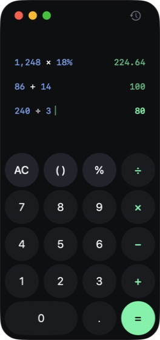

# Awesome Calculator

A compact, expression-first calculator for macOS, built with SwiftUI.

一款紧凑、以完整算式为核心的 macOS 原生计算器，使用 SwiftUI 构建。



[中文](#中文) · [English](#english)

## 中文

### 功能

- 保留完整输入过程，计算后仍可查看原始算式。
- 支持 `+`、`−`、`×`、`÷`、`%`、小数和括号运算。
- 可直接粘贴长算式并立即得到结果。
- 自动兼容中文与全角符号，例如 `（ ）`、`＋`、`－`、`＊`、`／`。
- 支持数字键、运算符、回车、退格以及 `Command + V`。
- 右侧可展开历史记录，支持复制算式、结果或完整记录。
- AC 只清除当前输入，不会误删历史记录。
- 完全本地运行，不需要网络连接。

示例：

```text
2+5+18+55+（2*5）/3+75
```

### 系统要求

- macOS 13 或更高版本
- Xcode 15 或更高版本

### 本地运行

```bash
git clone https://github.com/genoooool/awesome-calculator.git
cd awesome-calculator
open ModernCalculator.xcodeproj
```

在 Xcode 中选择 `ModernCalculator` Scheme，然后按 `Command + R`。

### 键盘操作

| 按键 | 操作 |
| --- | --- |
| `0–9`、`.` | 输入数字 |
| `+`、`-`、`*`、`/`、`%` | 输入运算符 |
| `(`、`)` | 输入括号 |
| `Enter` 或 `=` | 完成计算 |
| `Backspace` | 删除上一位 |
| `Esc` 或 `C` | 清除当前输入 |
| `Command + V` | 粘贴并计算表达式 |

## English

### Features

- Keeps the complete expression visible after calculation.
- Supports `+`, `−`, `×`, `÷`, `%`, decimals, and parentheses.
- Evaluates long pasted expressions immediately.
- Normalizes Chinese and full-width symbols such as `（ ）`, `＋`, `－`, `＊`, and `／`.
- Supports number keys, operators, Return, Backspace, and `Command + V`.
- Provides an expandable history panel with copyable expressions, results, and full records.
- AC clears only the current input and leaves history untouched.
- Runs entirely on-device with no network connection required.

Example:

```text
2+5+18+55+（2*5）/3+75
```

### Requirements

- macOS 13 or later
- Xcode 15 or later

### Run locally

```bash
git clone https://github.com/genoooool/awesome-calculator.git
cd awesome-calculator
open ModernCalculator.xcodeproj
```

Select the `ModernCalculator` scheme in Xcode and press `Command + R`.

### Keyboard controls

| Key | Action |
| --- | --- |
| `0–9`, `.` | Enter numbers |
| `+`, `-`, `*`, `/`, `%` | Enter operators |
| `(`, `)` | Enter parentheses |
| `Enter` or `=` | Evaluate |
| `Backspace` | Delete the previous character |
| `Esc` or `C` | Clear the current input |
| `Command + V` | Paste and evaluate an expression |

## Project structure

- `ModernCalculator/CalculatorView.swift` — window, keypad, calculation tape, and history UI.
- `ModernCalculator/CalculatorViewModel.swift` — tokenizer, parser, evaluation, formatting, and history state.
- `ModernCalculator/Assets.xcassets` — app icon and color assets.

## Built with

- Swift
- SwiftUI
- AppKit
